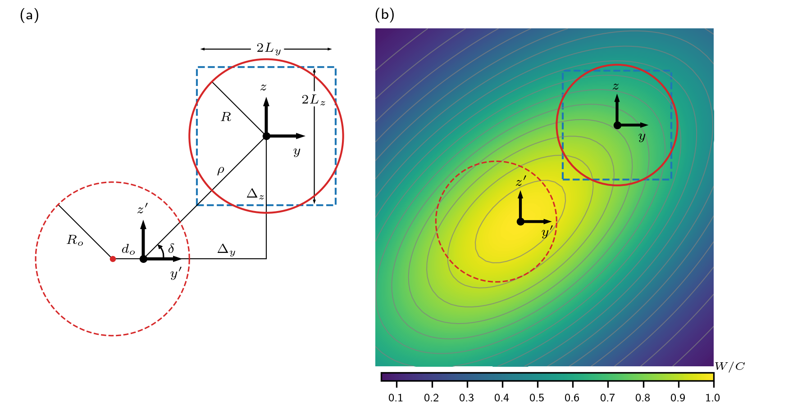

# Rotor-averaged wind-speed deficit of a turbine in a non-axisymmetric Gaussian wake

This repository contains a Python implementation of an analytical expression for the rotor-averaged wind-speed deficit of a turbine placed in a non-axisymmetric Gaussian wake. 

## Background



For a set of axes $y'$ - $z'$ placed at the center of the wake, the normalised wind-speed deficit here is defined as

$$W = Ce^{-(y'+\omega z')^2/(2\sigma_y^2)} e^{-z'^2/(2\sigma_z^2)}$$

where, 
- $C$ is a streamwise scaling function
- $\omega$ is a wind-veer coefficient that relates to the difference in wind direction ($\Delta \alpha_o$) across the top and bottom tips of a the wake source via $\omega=\Delta \alpha_o (x/D_o)$ with $x$ being the distance downstream of the wake source and $D_o$ being the wake-source diameter
- $\sigma_y$ and $\sigma_z$ are the wake standard deviations in the $y'$ and $z'$ directions, respectively.

The presented expression integrates the equation for $W$ across either a circular disk or a rectangular disk (see figure above), depicting the rotor of a downstream turbine, which is offset from the wake center by the radial distance $\rho$ and the angle $\delta$. Since, $\sigma_y$ and $\sigma_z$ are not equal in the general case of a yawed wake source, the two standard deviations are related via the eccentricity $\xi$ such that 

$$\xi^2=1-(\sigma_y/\sigma_z)^2$$

Here, we use $\sigma_z=\sigma$ and hence $\sigma_y = \sigma \sqrt{1-\xi^2}$.

The rotor-averaged value of $W$ for an averaging order $n>0$ is
```math
    \overline{W}^{(n)}  
    =\left(\frac{1}{A} \iint\limits_A W^n ~dA \right)^{1/n},
```
where $A$ is the area of the disk representing the turbine.

## Circular disk representation of a turbine
If the downstream turbine is to modelled as a circular disk of radius $R$, then the rotor-averaged deficit is
```math
\overline{W}_c^{(n)} \approx C e^{-\rho^2/(2\hat{\sigma}^2)}\left(2\mu_0^{(n)} (1+2P_{\textrm{ns}}^{(n)})-\frac{2\sigma_*^2}{nR^2} e^{-nR^2 / (2\sigma_*^2)} P_{\textrm{ns}}^{(ns)} \left[\frac{\lambda}{\rho} I_{1}\left(\frac{nR\rho}{\sigma_\textrm{s}^2}\right)+\frac{\lambda^2}{\rho^2} I_{2}\left(\frac{nR\rho}{\sigma_\textrm{s}^2}\right)\right] \right)^{1/n}
```

where $R$ is the radius of the turbine whose rotor-averaged deficit is sought. Multiple constants are included in this expression and are defined as
- $\tan{\phi_\textrm{ns}} = 2\omega / (\xi^2 - \omega^2)$
- $\tan{\phi_\textrm{s}} = \omega + \tan{\delta}\left(1-\xi^2\right)  / (1+\omega\tan{\delta})$
- $\phi=2\phi_\textrm{s}-\phi_\textrm{ns}$

- $\sigma_\textrm{s}^2 = 
    \sigma^2\left(1-\xi^2\right) \cos{\phi_\textrm{s}} / (\cos{\delta}+\omega\sin{\delta})$
- $\sigma_\textrm{ns}^2
    =2\sigma^2(1-\xi^2) / \sqrt{(\omega^2-\xi^2)^2+4\omega^2}$
- $\sigma_{*}^2
    =2\sigma^2(1-\xi^2) / (2+\omega^2-\xi^2)$
- $\hat{\sigma}^{-2} = \sigma_{*}^{-2} + \sigma_\textrm{ns}^{-2}\cos{(2\delta-\phi_\textrm{ns})}$
- $\lambda=R\sigma_\textrm{s}^2/\sigma_{*}^2$
- $P^{(n)}_{\textrm{ns}} = e^{-n\chi_{\textrm{ns}}^2 \cos{\phi}} \cos{(n\chi_{\textrm{ns}}^2 \sin{\phi})}-1$
- $\chi_{\textrm{ns}} = \rho \sigma_{*}^2/(2\sigma_\textrm{ns} \sigma_\textrm{s}^2)$

The integral $\mu_0^{(n)}$ is 

$$\mu_0^{(n)} = \int\limits_{0}^{1} \eta e^{-n\eta^2 R^2/(2\sigma_{*}^2)} I_0 \left(\frac{n\eta R\rho}{\sigma_\textrm{s}^2}\right)~d\eta$$

and is evaluated as

```math
\mu_0^{(n)} = \frac{\sigma_{*}^2}{nR^2} e^{-nR^2/(2\sigma_{*}^2)} \Psi^{(n)}(R,\rho,\sigma_\textrm{s},\sigma_*)
```

such that

```math
\Psi^{(n)}(R,\rho,\sigma_\textrm{s},\sigma_*) = I_0 \left(\frac{nR\rho}{\sigma_\textrm{s}^2}\right) \sum_{k\ge1}  \left[\left(\frac{nR^2}{2 \sigma_{*}^2}\right)^{k} f_k(n\tau^2) \right] - \frac{nR\rho}{\sigma_\textrm{s}^2} I_1 \left(\frac{nR\rho}{\sigma_\textrm{s}^2}\right) \sum_{k\ge1} \left[ \left(\frac{nR^2}{2 \sigma_{*}^2} \right)^{k} g_k(n\tau^2)\right]
```

where $\tau = \rho\sigma_{*}/\sigma_\textrm{s}^2$ and 

$$f_k(v) = \frac{f_{k-1}(v) + v g_{k-1}(v)}{k}, \quad g_k(v) = \frac{f_{k}(v) + 2g_{k-1}(v)}{2k}$$

with the initial conditions $f_0=1$, $g_0=0$.

## Rectangular disk representation of a turbine
An alternative approach to obtain the rotor-averaged deficit of a turbine is to model the rotor as a rectangular disk rather than a circular one. 

Solving the resulting integrals for a rectangular is often easier than a circular domain, without the need of using simplifying assumptions.

For a rectangular disk of side lengths $2L_y$ and $2L_z$ in the $y$ and $z$ directions, respectively, the rotor-averaged deficit is

```math
    \overline{W}_r^{(n)} = C
    \left(
    \frac{\pi \sigma^2 \sqrt{1-\xi^2}}{2n  L_y L_z}
    \sum\limits_{s_y, \, s_z \in \{-1,1\}}
    (-s_y s_z)
    \Omega\left(\frac{\Delta_z+ s_z L_z}{\sigma/\sqrt{n}}, \frac{\omega}{\sqrt{1-\xi^2}}, \frac{\Delta_y + s_y L_y}{\sigma\sqrt{(1-\xi^2)/n}}\right)
    \right)^{1/n},
```
which is simply evaluating the function $\Omega$ at the four vertices of the rectangular disk. The function $\Omega$ is defined as

```math
\Omega(h,a,b) = \frac{1}{2\pi} \left(\arctan{(a)} -\arctan{(a+b/h)} - \arctan{\left(\frac{h+ab+a^2 h}{b}\right)}\right) + \frac{1}{4} \textrm{erf}\left(\frac{b}{\sqrt{2(1-a^2)}}\right) +  \textrm{T}(h,a+b/h) \\ &  \quad\quad\quad + \textrm{T}\left(\frac{b}{\sqrt{1+a^2}},\frac{h+ab+a^2h}{b}\right),
```
where $\textrm{T}(h,a)$ is [Owen's T function](https://en.wikipedia.org/wiki/Owen%27s_T_function), and erf is the [error function](https://en.wikipedia.org/wiki/Error_function).

The size of the rectangular disk is
```math
L_y = L_z = 0.9 R
```

## Usage

To use this function, include the following lines in your code:
```
from REWS import anl_rews
w_c = anl_rews(R, rho, delta, xi, omega, n, method)
```

The function "anl_rews" takes in
- the radius "R" and
- the radial offset $\rho$ "rho"

in a non-dimensional form by normalising the dimensional quantities by the wake standard deviation $\sigma$.

It also takes in
- the angle $\delta$ between the two turbines
- the eccentricity $\xi$ of the wake elliptic contours
- the veer coefficient $\omega$
- [optional] the averaging order $n$, where the default value is one
- [optional] the method of representing turbine, which is either "circular" or "rectangular" with a default value of "rectangular"

It then returns the rotor-averaged deficit $\overline{W}$ normalised by the streamwise scaling function $C$ (i.e., $\overline{W}/C$).
